# OS_Memory_Management
Tongji SSE OS course project

# **设计方案报告-动态分区分配模拟**

### **1953981 吴昊天**

## **项目背景分析**

项目需要实现一个动态分区分配方式的模拟，动态分区分配是一种连续内存分配方式。对于内存的管理，按照分配方式是**连续的**还是**非连续**的，一般可以分为下面两种管理方式：**连续内存管理方式**、**非连续内存管理方式**

+ **连续内存分配方式**：连续内存管理方式是指为一个用户程序分配一个连续的内存空间，连续内存分配方式主要可以包括**单一连续分配**、**固定分区分配**、**动态分区分配**等三种方式。

  **单一连续分配**：内存在这种情况下被分成**用户区**和**系统区**，系统区仅供操作系统使用，一般在低地址部分，用户区是为用户提供的、除系统区之外的内存空间。这种方式的优点是简单、无外部碎片，但是缺点是只能用于单用户、单任务，有内部碎片，存储器的利用率极低

  **固定分区分配**：将内存空间划分为若干固定大小的区域，每个分区只装入一道作业，有两种分区分配方式：**分区大小相等**、**分区大小不等**，这种方式存在两个问题：程序太大而放不进任何一个分区；主存利用率低，当程序小于固定分区时，也需要占用一个分区，存在内部碎片

  **动态分区分配**：动态分区分配又称为可变分区分配，动态地划分内存。这种方法不预先划分内存，而是在进程装入内存时，根据进程的大小动态地建立分区。在进程装入主存或换入主存时，若内存中有多个足够大的空闲块，则需要考虑动态分区的分配策略：

   - **首次适应算法**：空闲分区以地址递增的次序链接。分配内存时按顺序查找，找到大小能够满足要求的第一个空闲分区
   - **最佳适应算法**：空闲分区按容量递增的次序链接，找到第一个能满足要求的空闲分区
   - **最坏适应算法**：空闲分区以容量递减的次序链接，找到第一个能满足要求的空闲分区
   - **临近适应算法**：由首次适应算法演变而成，不同是，分配内存从上次查找结束的位置开始继续查找

  这几种算法中首次适应算法不仅是最简单的，而且通常也是最好和最快的。邻近适应算法试图解决这个问题，但是常常导致在内存的末尾分配空间分裂成小碎片，而最佳适应算法每次分配会留下很多的很小的内存块，难以再次利用，最坏适应算法会导致很快没有大的内存块使用，因此性能也很差

+ **非连续分配管理方式**:一般有**分页存储管理方式**，和**分段存储管理方式**，这两种方式显然可以实现比连续内存分配方式更高的性能，但在本文中不在赘述。

## **开发运行环境**

Qt版本：`Qt5.9.8`

Qt Creator版本：`4.8.2`

编译器：`MinGW 5.3.0 32bit`

## **功能点实现**

+ **实时显示主存占用情况**

  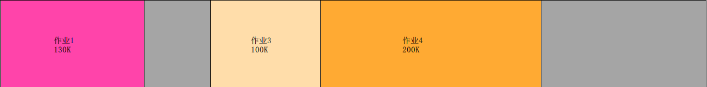

  执行申请或释放操作之后，占用主存的作业进程在主存中显示画出，并用不同的颜色标识，同时在对应的块上用文字标出作业号和占用内存大小，灰色部分显示的未占用内存

+ **日志信息显示**

  

  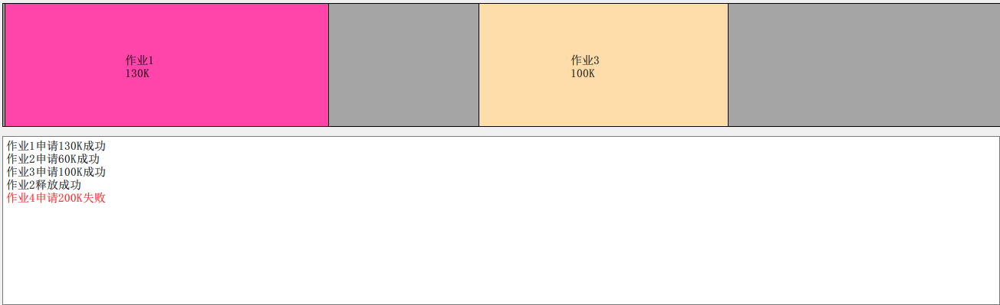

  在每次进行操作后，显示操作的信息，包括操作的作业号，内存大小，成功与否

+ **内存大小调节**

  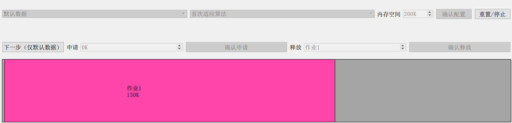

  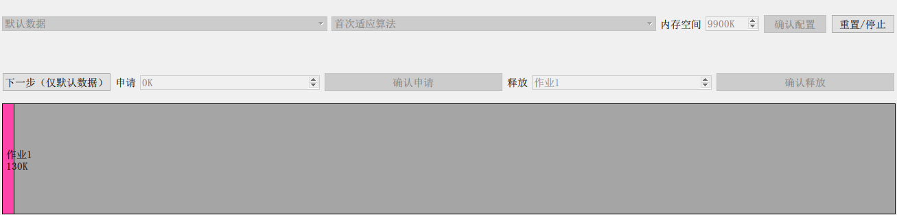

  自定义的调节内存大小，可以实现从`0K`到`10000K`内存大小的调节，对应的内存显示也随之变化

+ **不同的分配算法选择**

  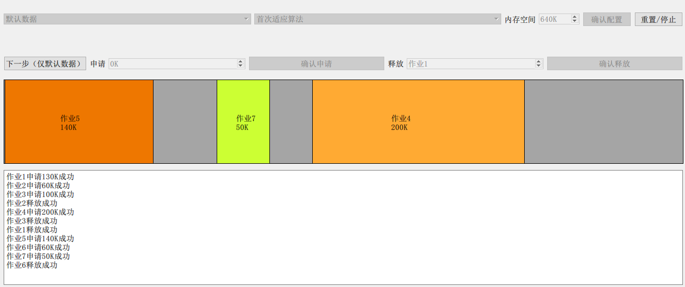

  选择**首次适应**算法后，使用**默认数据**运行到最后一步的结果

  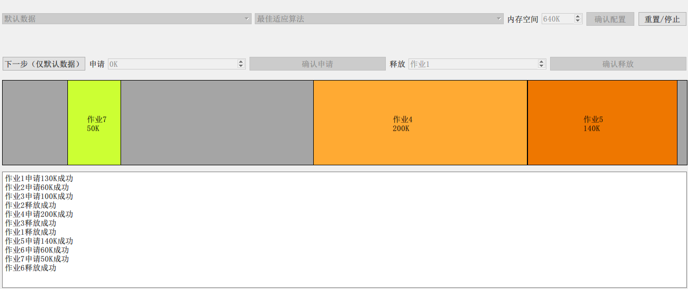

  选择**最佳适应**算法后，使用**默认数据**运行到最后一步的结果

+ **使用默认数据运行**

  使用ppt中给定数据进行运行，不需要手动输入需要申请的内存大小，以下是在**首次适应算法**下的部分运行图，两种算法总的运行图已经过验证，满足各算法的要求。

  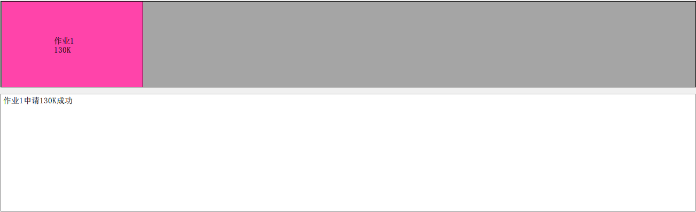

  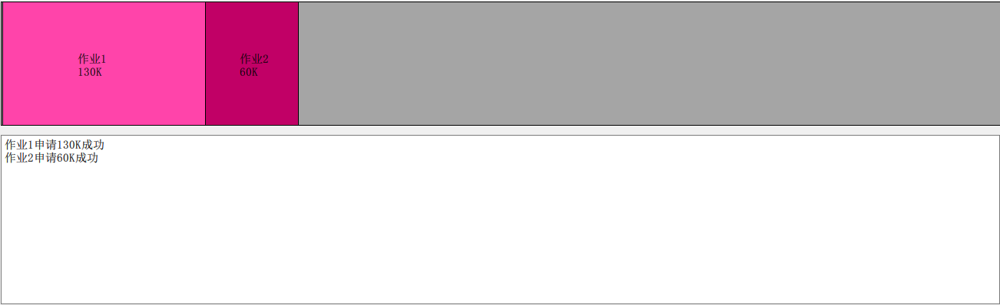

  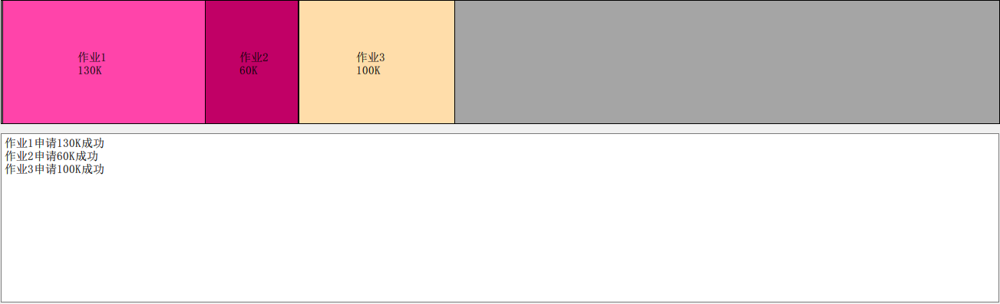

  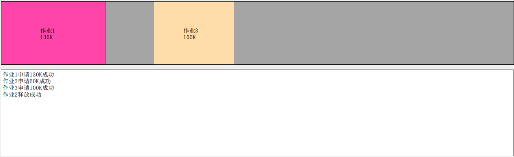

  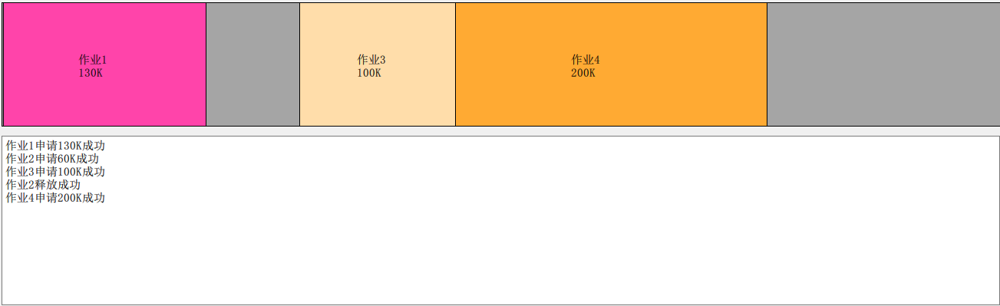

  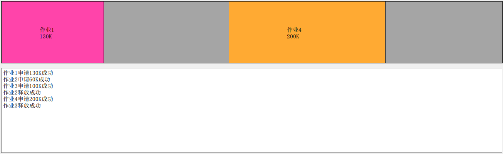

  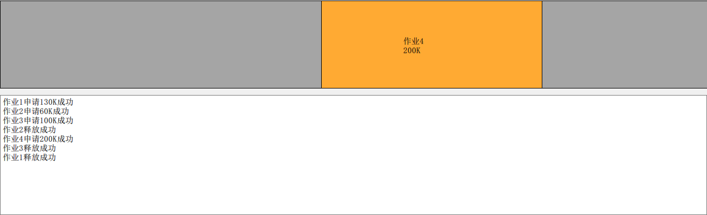

  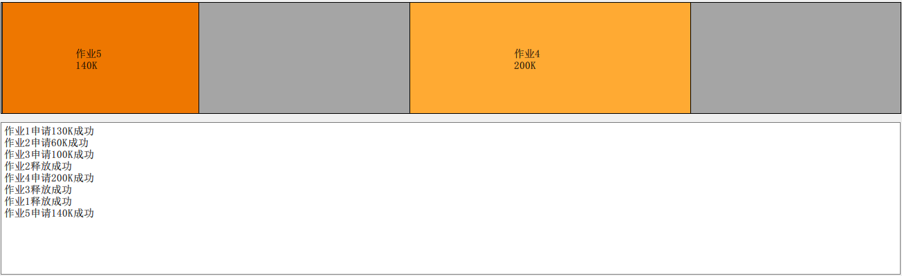

  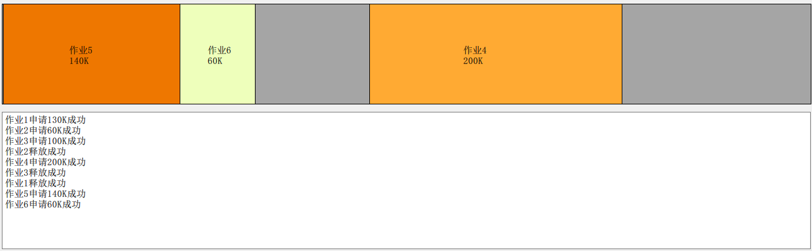

  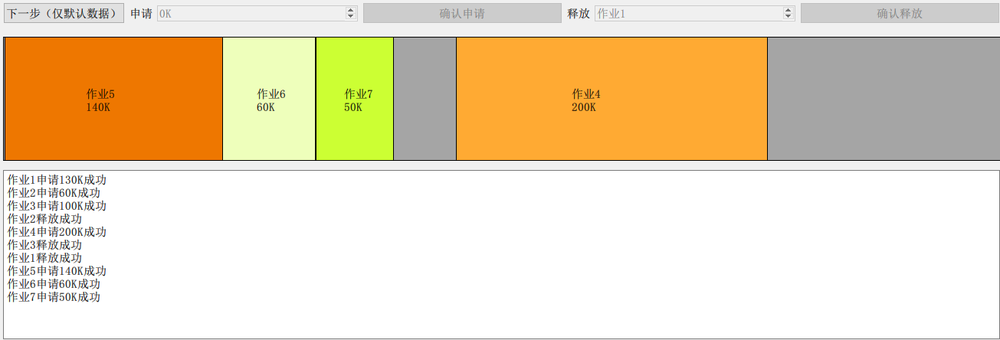

  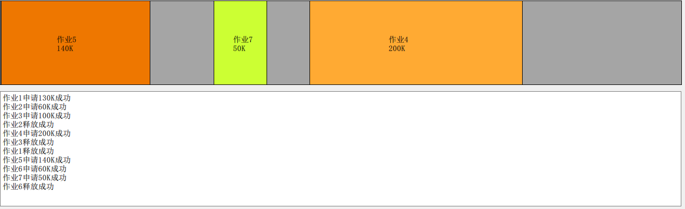

+ **自定义数据运行**

  由于自定义数据可以很多，这里只展示一次运行中部分状态的截图，此次选择**最佳适应算法**来进行测试，并且设置自定义的**内存大小**

  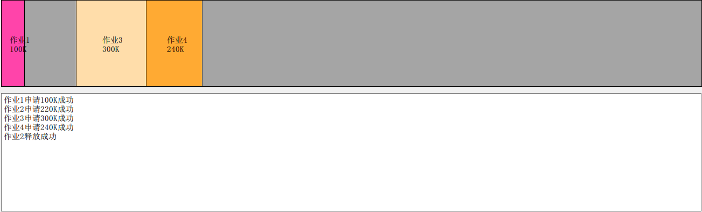

  

  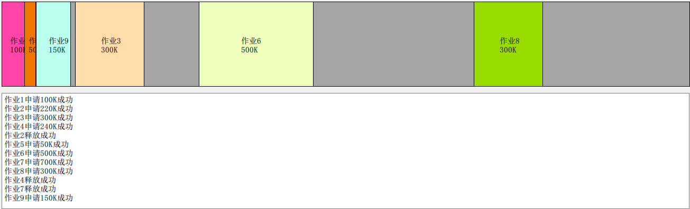

  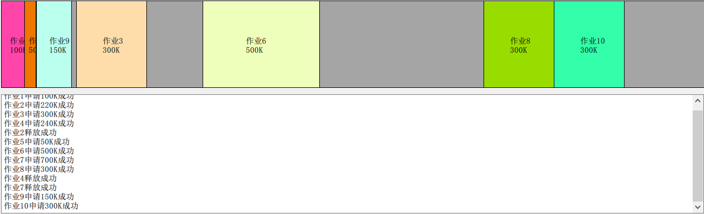

  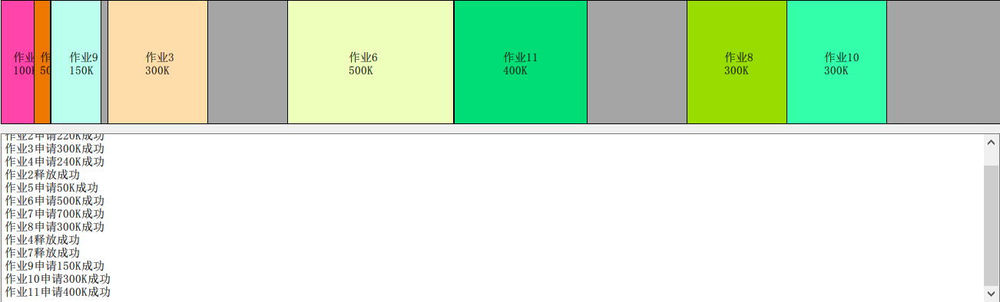

  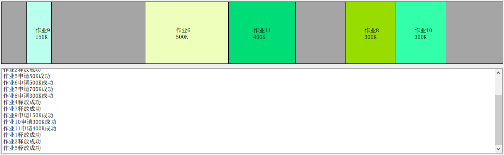

+ **其他功能**

  

  

  点击**确认配置**按钮之后，使得相应的按钮被禁用，避免误触

  

  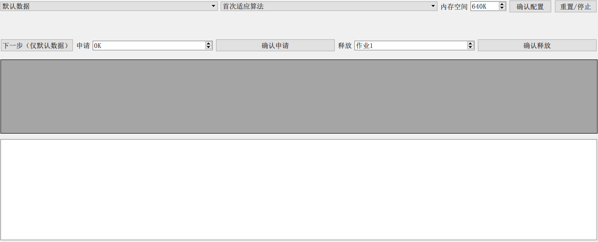

  **重置/停止**按钮将所有的**设置**和**内存显示区**以及**日志区**全部清零，

## **部分代码分析**

+ **内存模型部分**

  - 各种常量

    ```c++
    //数据源的来源 ： 默认和手动输入
    enum data_source {
        DEFAULT,
        CUSTOMIZE
    };
    //两种算法的选择，首次适应和最佳适应
    enum algorithm {
        FIRST_FIT,
        BEST_FIT
    };
    //默认的申请队列
    const int default_data[11][2] = {{1, -130},{2, -60},{3, -100},{2, +60},{4, -200},{3, +100},{1, +130},{5, -140},{6, -60},{7, -50},{6, +60}
    };
    ```

  - 结构体封装

    ```c++
    typedef struct a {
        int start_addr;
        int lenth;
    } ram_block;//内存块
    typedef struct b {
        int job_num;
        ram_block block_in_ram;
    } job;//作业
    typedef struct c {
        int job_num;
        int apply_or_release;
        bool request_state;
        int lenth;
    } request_inf;//发出请求之后的日志信息
    ```

  + 合并函数

    ```c++
    void RAMModel::merge_block(ram_block block)
    {
        bool is_merged = false;//判断有没有归并过
        for(auto it = free_space.begin(); it != free_space.end(); it++)
        {
            if(block.start_addr + block.lenth == (*it).start_addr)//在现有区间的左侧合并
            {
                //合并的新区间
                ram_block new_block = {block.start_addr, block.lenth + (*it).lenth};
                block = new_block;
                is_merged = true;//设置为归并过
                free_space.erase(it);//将合并的原有区间先拿出来
                break;
            }
            if(block.start_addr == (*it).start_addr + (*it).lenth)//在现有区间的右侧合并
            {
                ram_block new_block = {(*it).start_addr, block.lenth + (*it).lenth};
                block = new_block;
                is_merged = true;//设置为归并过
    
                free_space.erase(it);//将合并的原有区间先拿出来
                break;
            }
        }
        //如果第一次都没有归并过就直接退出
        if(is_merged == false)
        {
            insert_remain(block);
            return;
        }
        //第二次归并
        for(auto it = free_space.begin(); it != free_space.end(); it++)
        {
            if(block.start_addr + block.lenth == (*it).start_addr)//在现有区间的左侧合并
            {
                //合并的新区间
                ram_block new_block = {block.start_addr, block.lenth + (*it).lenth};
                block = new_block;
                is_merged = true;//设置为归并过
    
                free_space.erase(it);//将合并的原有区间先拿出来
                break;
            }
            if(block.start_addr == (*it).start_addr + (*it).lenth)//在现有区间的右侧合并
            {
                ram_block new_block = {(*it).start_addr, block.lenth + (*it).lenth};
                block = new_block;
                is_merged = true;//设置为归并过
                free_space.erase(it);//将合并的原有区间先拿出来
                break;
            }
        }
        //将归并后的区插入到空闲区中
        insert_remain(block);
    }
    ```

    在释放某个作业后，将释放的内存合并到原有的空闲内存中

  + 插入函数

    ```c++
    void RAMModel::insert_remain(ram_block block)
    {
        if(free_space.empty() == true)//free_space为空的话，直接插入
        {
            free_space.push_back(block);
            return;
        }
        if(algorithm_kind == FIRST_FIT)//首次适应
        {
            for(auto it = free_space.begin(); ; it++)//按地址递增的插入
            {
                if(it == free_space.end())//在最后插入
                {
                    free_space.insert(it, block);
                    return;
                }
                if(block.start_addr < (*it).start_addr)//如果比当前的小，就插入
                {
                    free_space.insert(it, block);
                    return;
                }
            }
        }
        else if(algorithm_kind == BEST_FIT)//最佳适应
        {
            for(auto it = free_space.begin(); ; it++)\
            {
                if(it == free_space.end())//如果遍历到了最后
                {
                    free_space.insert(it, block);
                    return;
                }
                if(block.lenth <= (*it).lenth)//按容量递增的来插入
                {
                    free_space.insert(it, block);
                    return;
                }
            }
        }
    }
    ```

    根据选择的分配模式，来执行收回内存的插入，来实现**首次适应算法**和**最佳适应算法**

+ **显示部分**

  - 绘制部分

    ```c++
    void MainWindow::paintEvent(QPaintEvent *event)
    {
        //绘制区域的坐标
        auto origin_x = ui->RAMtextEdit->geometry().x();
        auto origin_y = ui->RAMtextEdit->geometry().y();
        auto width = ui->RAMtextEdit->geometry().width();
        auto height = ui->RAMtextEdit->geometry().height();
        QPainter painter(this);
        QPen pen; //画笔
        pen.setColor(QColor(0, 0, 0));//黑色画笔画外框
        QBrush brush(QColor(165, 165, 165, 255)); //画刷
        painter.setPen(pen); //添加画笔
        painter.setBrush(brush); //添加画刷
        painter.drawRect(origin_x, origin_y, width, height); //绘制总体外框
        QColor color_collection[16] = {QColor("#FFB7DD"),QColor("#FF44AA"),QColor("#C10066"),QColor("#FFDDAA"),QColor("#FFAA33"),QColor("#EE7700"),QColor("#EEFFBB"),QColor("#CCFF33"),QColor("#99DD00"),QColor("#BBFFEE"),QColor("#33FFAA"),QColor("#00DD77"),QColor("#CCDDFF"),QColor("#5599FF"),QColor("#0044BB"),QColor("#9955FF"),
    };
        for(unsigned int i = 0; i < model.jobs_in_ram.size(); i++)
        {
            QBrush brushTemp(color_collection[model.jobs_in_ram[i].job_num % 15]);
            painter.setBrush(brushTemp);//设置颜色
            //位置设置
            auto block_x = (width * (model.jobs_in_ram[i].block_in_ram.start_addr + 1) / model.get_capacity()) + origin_x;
            auto block_y = origin_y;
            auto block_width = width * model.jobs_in_ram[i].block_in_ram.lenth / model.get_capacity();
            auto block_height = height;
            qDebug() << block_x << block_y << block_width << block_height << color_collection[model.jobs_in_ram[i].job_num % 15];
            painter.drawRect(block_x, block_y, block_width, block_height);
            QString job_num("作业");
            job_num += QString::number(model.jobs_in_ram[i].job_num);
            painter.drawText(block_x + block_width / 2 - width * block_width / 10000, block_y + block_height / 2, job_num);
            QString job_lenth;
            job_lenth += QString::number(model.jobs_in_ram[i].block_in_ram.lenth) + "K";
            painter.drawText(block_x + block_width / 2 - width * block_width / 10000, block_y + block_height / 2 + height / 9, job_lenth);
        }
    }
    ```

